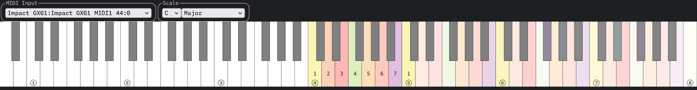
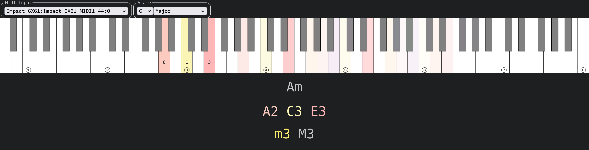

# Pia's


`Pia's` stands for "Pia's Interval Analysis Screen". `Pia's` is a MIDI analysis web application. 

In Japanese, `Pia's` can be written as ぴあの which is pronounced "piano" (🎹).

`Pia's` is also my first try at writting a small WASM web application.

## Features

- Full size (88-key) keyboard visualization.
- Listens to a single MIDI input device, like a MIDI keyboard.
- Understands common musical scales. Notes outside the scale are highlighted differently. A text overlay indicates the scale degree of each pressed note.
- Understands the use of the sustain pedal. Notes sustained by the pedal are colored differently than held notes.
- Identifies common chords and their extensions.
- Pressed / held keys are colored according to their relationship to the tonic center, i.e. each scale degree has its own color.
- Highlights the overtones of the pressed note.
- Highlights intervals played below an "low interval limit"
- Visualization of chord quality in the form of a Tonnetz
- Roman numeral analysis in the form of a circle of fifths

**NOTE** `Pia's` does not produce audio nor MIDI output. Do not expect sound to come from it..

## Color theme

The color theme has been chosen by overlaying the 12-color wheel (with red, yellow and blue as primary colors) on top of the circle of fifths.

That results in the following colors, going through the circle of fifths in clockwise direction.

| Degree | Color                    |
|:------:|:------------------------:|
| 1      | red (primary)            |
| 5      | red orange (tertiary)    |
| 2      | orange (secondary)       |
| 6      | yellow orange (tertiary) |
| 3      | yellow (primary)         |
| 7      | yellow green (tertiary)  |
| ♯4     | green (secondary)        |
| ♭2     | blue green (tertiary)    |
| ♭6     | blue (primary)           |
| ♭3     | blue violet (tertiary)   |
| ♭7     | violet (secondary)       |
| 4      | red violet (tertiary)    |

That means that the notes in major scales get red/yellow colors, which are considered "warm".



Whereas the minor scales include some blue-ish colors which are considered "cool".


## Highlighting overtones

When you pluck the A3 string on a guitar, more than one pitch at 220Hz is heard.
One hears the fundamental frequency and the overtones, frequencies which are multiple of the fundamental frequency.
`Pia's` highlights these overtones but with less intensity than the pressed note;
this mimics reality (as far as acoustic instruments go) as overtones often have less power than the fundamental frequency.

The overtones can be mapped back to an interval with respect to the fundamental frequency.
Consider the following table which lists the overtones of the A2 note (assuming 12-tone equal temperament).

| Frequency (Hz) | ~Note | Interval | Half steps |
|:--------------:|:-----:|:--------:|------------|
| 110            | A2    | P0       | 0          |
| 220            | A3    | P8       | 12         |
| 330            | E4    | P8+P5    | 19         |
| 440            | A4    | 2*P8     | 24         |
| 550            | C#5   | 2*P8+M3  | 28         |
| 660            | E5    | 2*P8+P5  | 31         |
| 770            | G5    | 2*P8+m7  | 34         |
| 880            | A5    | 3*P8     | 36         |
| 990            | B5    | 3*P8+M2  | 38         |
| 1100           | C#6   | 3*P8+M3  | 40         |
| (..)           | (..)  | (..)     |            |
 
These intervals will hold regardless of the note pressed.


## Low Interval Limit

The low interval limit is the lowest recommended pitch at which an interval should be played.
Playing the interval below this limit makes the interval sound "muddy" or unclear.
When `Pia's` identifies an interval that lies is below its low interval limit, it'll highlight it in yellow.

For example, in the root position version of a A minor chord build on note `A2`, the minor third interval is below the low interval limit of `C3`. 



Inverting the chord by moving the note `A` up one octave solves the issue: the lowest interval, now a major third on note `C3`, sits above its low interval limit of `Bb2`.


## Tonnetz

A Tonnetz, or "tone network", is a grid arrangement of notes where the interval between two horizontally adjacent notes is a perfect fifth and the interval between two diagonally adjacent notes is a third, which can be either minor or major depending of the direction.

`Pia's` show a Tonnetz with a spread of 4 nodes from the tonic center of the scale.
To distinguish between major, minor and other modes, the notes outside the scale are not circled.

Upon playing a chord, `Pia's` will highlight the pressed notes in the Tonnetz with a change of brightness.
As notes repeat in the Tonnetz, `Pia's` will only highlight the notes closest to the tonal center while also picking the notes that are closest to each other forming a cluster.

A Tonnetz helps visually chord qualities as each chord type has a different geometric shape: major and minor triads are triangles; suspended triads are horizontal lines; etc.


## Roman numeral analysis

In roman numeral analysis, the (tertiary) chords build on each of the major scale notes are given a roman number from `I` to `VII`. 
Major chords are distinguished from minor chords using casing: major chords are uppercase, e.g. `IV`, whereas minor chords are lowercase, e.g. `iv`.
For non-major scales, roman numbers are modified using a flat or sharp like one would do with scale degrees.

`Pia's` displays both major and minor chords using roman numerals arranged in a circle of fifths.
This lets one visualize chord progressions that move by descending perfect fifths, which are common in jazz.

Chords are arranged in two concentric circle of fifths with major chords in the outer one and minor chords in the inner one.
This arrangement lets one visualize the use of chords borrowed from a parallel key in progressions that use modal interchange.


## Build dependencies

See [`shell.nix`](./shell.nix).

## Live/hosted instance

May be out of date: https://japaric.github.io/Pia-s

## Run/host locally

0. Connect a MIDI input device to your computer. Note that you can also connect a virtual MIDI loopback device, like 'MIDI Through' on Linux, to the web application and drive it entirely by software, e.g. a DAW.

1. Build the web application and start a web server that listens on port 8000.

``` console
$ just serve
```

2. Browse to `http://localhost:8000`.

3. Grant the web application access to your MIDI devices.

4. Select your MIDI input device from the drop-down menu in the web application.

5. (Optionally) change the Scale using the drop down menus.

6. Input MIDI using your MIDI input device.

**NOTE** Some DAWs take exclusive control of input devices. If you want to use this web application alongside a DAW, you'll need to set up a virtual MIDI loopback device and do some additional routing to duplicate the MIDI input onto a second MIDI device; then each application needs to connect to a different MIDI device. Exact instructions on how to do that are out of scope for this document.
